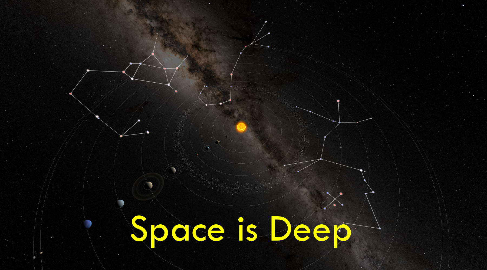

# Space Is Deep
A 3D visual exploration of some well known constellations. 

## Abstract
Constellations like Orion, Scorpius, and the Southern Cross are familiar and seemingly eternal, etched permanently into our night sky. In reality, their shapes exist only from our unique viewpoint on Earth, a chance alignment within the vast depths of space.

Using 3D visualisations, we will leave Earth behind us and travel out towards the stars. As we move through space, the night sky transforms from a flat map above our heads into a vast cosmic structure surrounding us on all sides. The constellations we know and love begin to twist and unravel. From these new perspectives, familiar patterns become strange and distorted, revealing just how deep space really is.

## Recurring Visual Language
Use these as a consistent toolkit throughout the film:
- IAU chart
- remove boundaries/artwork
- main stars
- Earth viewpoint
- 3D positions
- change viewpoint
- return to Earth

But progressively remove steps as the audience learns the language.

That progression should keep the film feeling like an unfolding discovery rather than five repetitions of the same demonstration.

# 1. The Sky We Know
- Beautiful star field.
- No lines initially.
- Gradually reveal familiar constellations.
- IAU chart/artwork briefly appears.
- Leo - Orion - Scorpius - Crux.

> For thousands of years,
> we've looked up at the night sky
> and told stories of the patterns we see

> We see animals and heroes
> gods and battles

> We see a lion...
> A cross.
> A scorpion.
> An emu.
> and, a hunter.
> all dwelling among the stars.

> We have given these patterns names, stories and boundaries.
> We've named their brightest stars.
> And when you see them, they become almost impossible to unsee.

> But there's something strange about these shapes.
> They're not really there!
> They are an illusion of 3D space, and our position in it.

# 2. Something Isn't Right
- Return to Leo.
- Hold familiar 2D view.
- Begin transitioning into 3D.
- Move slightly towards the stars.
- One star begins separating from the others.
- Brief glimpses of Orion and Crux doing the same.
- Cut back before fully explaining it.

> The stars making up constellations like Orion...
> ... aren't actually arranged like they seem...
> Some are relatively close to us.
> Others are hundreds, or thousands of light-years farther away.

> We're seeing the result of looking from one particular place.

> From Planet Earth.
> From Earth, 
> these patterns appear fixed, and timeless

> but in reality, 
> we are glimpsing an abirary alignment, 
> a chance perspective, 
> inside the vast depths of three-dimensional space.

> From other places, the stars form different patterns.
> And from far enough away, they may not resemble anything familiar at all.

> But from here, we feel home.

# Title
SPACE IS DEEP

# 3. Five Patterns
FORESHADOW
Rapid, intriguing clips. Don't explain each one.
- Leo: dramatic depth.
- Crux: travel through the Cross.
- Orion: rotate around 3D structure.
- Scorpius: move sideways.
- Sagittarius: pull away from the "teapot".
- Optional glimpse of Centaurus.

> So let's take a few of these familiar patterns,
> and take them apart.

> We'll leave Earth.
> We'll travel through the stars.
> and we'll look at where the stars actually are in 3D space.

> We'll look at them from new directions
> from directions that no human being has ever seen them from before.

> Because a constellation isn't a structure.
> It's just a point of view.

# 4. Leaving Earth
TEACH
- Show Earth.
- Show familiar sky / celestial sphere.
- Simplify to stars.
- Pull stars away from the apparent 2D sky into their 3D positions.
- Establish that the sky isn't a surface.

> Imagine standing on Earth and looking towards the constellation Leo.
> The stars appear to occupy positions on the sky around us.
> But the sky is not a surface.
> It's a direction.

> Every star is somewhere in three-dimensional space.
> And when we look at them from Earth,
> their different distances are compressed into a single view.

> Change your position...
> and you change the pattern.

# 5. Leo
DEMONSTRATE
- IAU chart
- Remove artwork / boundaries / labels
- Main stars only
- Earth viewpoint
- 3D positions
- Travel towards Leo
- Rotate around it
- Return to Earth

> As we return to the solar system, Leo comes back to us.

> This is what we see from Earth.
> The distinctive shape of the lion's head

> These stars look like neighbours.
> In space, they're anything but.

> Some of the stars in Leo are relatively close to us.
> Others are much more distant.

> But, calling a star "relatively close" ...
> is like calling a human "relatively small" compared with a galaxy.

scales

> These stars may be easy to visit using 3D graphics,
> but they are far beyond our reach in reality.

star close up (Proxima)

> The closest star to our Sun is Proxima Centauri, about 4.24 light-years away.
> It lies close to Alpha Centuari,
> the brightest star in the constellation Centaurus.

> But calling this star 'close' is stretching the word to its limit.

> A light-year is the distance light travels in one year - nearly 9.5 trillion kilometres.
> So at 4.24 light years, 
> Proxima is about 40 trillion kilometres away.
> This is an immense distance that's hard to fully understand.
> Imagine driving at a madly irresponsible 200 km/h.
> Even at that speed, it would take about 23 million years to reach Proxima Centauri.
> And that is our nearest neighbouring star system.
>
> The stars we see in the Milky Way can be hundreds or thousands of light-years away.
>
> Eta Leonis, for example, looks connected to Leo from Earth.
> But it is far more distant than the other main stars that make up the constellation.
>
> Eta Leonis lies about 1,270 light-years from Earth.
> At 200 km/h, it would take almost 7 billion years to get there.

> And deep within the boundaries of Leo,
> we can see galaxies like the famous Leo Triplet,
> millions of light-years away.

> And farther still,
> we see faint traces from the early universe,
> travelling across billions of light-years to reach us.

cut

> In this simulation, we can cross those vast distances in moments.
> In reality, some of these journeys would take longer than human civilisation has existed.

cut

> A constellation is not a physical group of nearby stars.
> It is a pattern created by perspective,
> a shape that exists because we are looking at the universe from right here.

> If we travelled far enough away from Earth,
> the stars would no longer line up in the same way.
> The constellations we know would gradually distort,
> and eventually their familiar patterns would disappear altogether.

# 6. Crux
REINFORCE
- IAU Crux.
- Strip away artwork and lines.
- Main stars.
- 3D representation.
- Slow movement through the structure.
- Return to Earth view.

> And this isn't something peculiar to Leo.
> Consider the Southern Cross.
> It's one of the most recognisable patterns in the southern sky.
> Four bright stars seem to make an almost perfect cross.

3D reveal:

> But again, the cross only exists from our viewpoint.
> These stars aren't connected.
> They're simply stars that happen to line up from our position in space.

Then:

> If we lived in a different part of the Milky Way,
> or in a distant galaxy, far from Earth,
> we'd see something else. Something alien.

Fly back to Earth

> But from Earth, we see the familiar shapes return.
> All a product of our position,
> on one small spiral arm,
> of one fairly ordinary galaxy,
> one among hundreds of billions of galaxies in the observable universe.

> We're not at the centre of anything.
> We're not in a special place.
> And yet, from here,
> we look up and see patterns.
> crosses, hunters, lions and swans.
> We tell stories of these patterns and give them meaning.

# 7. Orion
SPECTACLE
Give Orion the longest and most impressive 3D sequence.
- Recognisable Orion.
- IAU chart.
- Remove boundaries / artwork.
- Label major stars if useful.
- Reveal actual 3D positions.
- Slow travel through Orion.
- Rotate around the stars.
- Let the Belt visibly lose its shape.
- Return to Earth.

> Few constellations are as well recognised as Orion, 
> the mythical hunter in the sky.

> His body outlined by 4 bright stars,
> Bellatrix, Betelgeuse, Saiph and Rigel

> His belt marked by 3 bright stars in a row,
> Alnitak, Alnilam, and Mintaka

> And his sword shown by a line of stars
> and the spectacular Orion nebula,
> a vast cloud of gas and dust
> glowing with the light of newborn stars.

Pause and let the audience recognise it.

> From Earth, Orion looks almost like a flat drawing.
> But there is no flat drawing here in space.
> The stars in Orion are scattered through an enormous volume of space.
> Most are hundreds of light-years away.
> Others are even more distant.

During the travel:

> If you travelled far enough away...
> Orion would gradually disappear.
> Distorted by simple perspective.

Rotate to show the side K

> From the side, Orion looks more like a capital K
> than a mighty warrior that the ancient Greek astronomers saw.

> By moving our viewpoint deep into the stars, 
> patterns in the night sky transform 
> into vast and distorted 3D structures.

# 8. Scorpius
SURPRISE / CHANGE OF VIEWPOINT
Don't travel towards Scorpius in the same way.
Instead: start on Antares from behind Scorpius...!

> This is Antares, a red supergiant star,
> about 550 light-years from Earth.
> It dwarfs our Sun,
> with a diameter around 700 times larger.
>
> As we pull back from Antares,
> the other stars in Scorpius begin to appear,
>
> But we're not looking at Scorpius from Earth.
> We're seeing it from the other side.
>
> And from this direction,
> the scorpion is almost unrecognisable.

> As our viewpoint changes, 
> so do the patterns in the stars.

> we can see the night sky not as a flat map above our heads, 
> but as a deep and dynamic universe surrounding us.

# 9. Sagittarius
CHALLENGE THE AUDIENCE'S MENTAL MODEL
- Start with familiar Sagittarius "teapot".
- Strip to stars.
- Reveal 3D structure.
- Rather than immediately approaching, pull away.
- Let the shape dissolve into a collection of stars.

> When we draw a constellation like Sagittarius
> or an asterism like The Teapot...

> we tend to imagine that we're drawing an object.
> A shape with a front.
> A back.
> Perhaps even an inside.

> But there is no object.
> There's just a collection of stars in space.

# 10. There Is No Front
CONCEPTUAL CLIMAX
Bring the examples together.
- Leo
- Orion
- Scorpius
- Crux
- Sagittarius

All represented as 3D structures.
Slowly rotate around them.
Earth becomes visible as a tiny point.
Then change viewpoint dramatically.

> We live in a small region of a giant galaxy, in a vast Universe.
> From here, stars form patterns.
> But there is nothing special about our viewpoint.
> From somewhere else, the patterns are different.

# 11. Back to Earth
REFRAME
Return to the ordinary night sky.
- Leo.
- Orion.
- Scorpius.
- Crux.
- Lines briefly appear again.
- No more complex 3D diagrams.

> And yet...
> from Earth, these patterns are real.
> We really do see Orion.
> The Southern Cross.
> The sqaure of Pegasus.

> The patterns aren't wrong.
> They're a consequence of perspective.

> But they have become part of our shared human story
> written across the night sky.

# 12. Space Is Deep
WONDER / END
No diagrams.
Just the night sky.
Slow music.

> For thousands of years, 
> people have stood beneath these same stars.
> Different cultures. Different stories
> But the same human instinct to look up, 
> find patterns, 
> and search for meaning.

> The next time you look up at the night sky...
> and see a hunter.
> Or a scorpion.
> Or a cross.

> Remember...

> you're not looking at a picture.

> You're looking into space.

> And space is deep.

# Title
SPACE IS DEEP
then black
